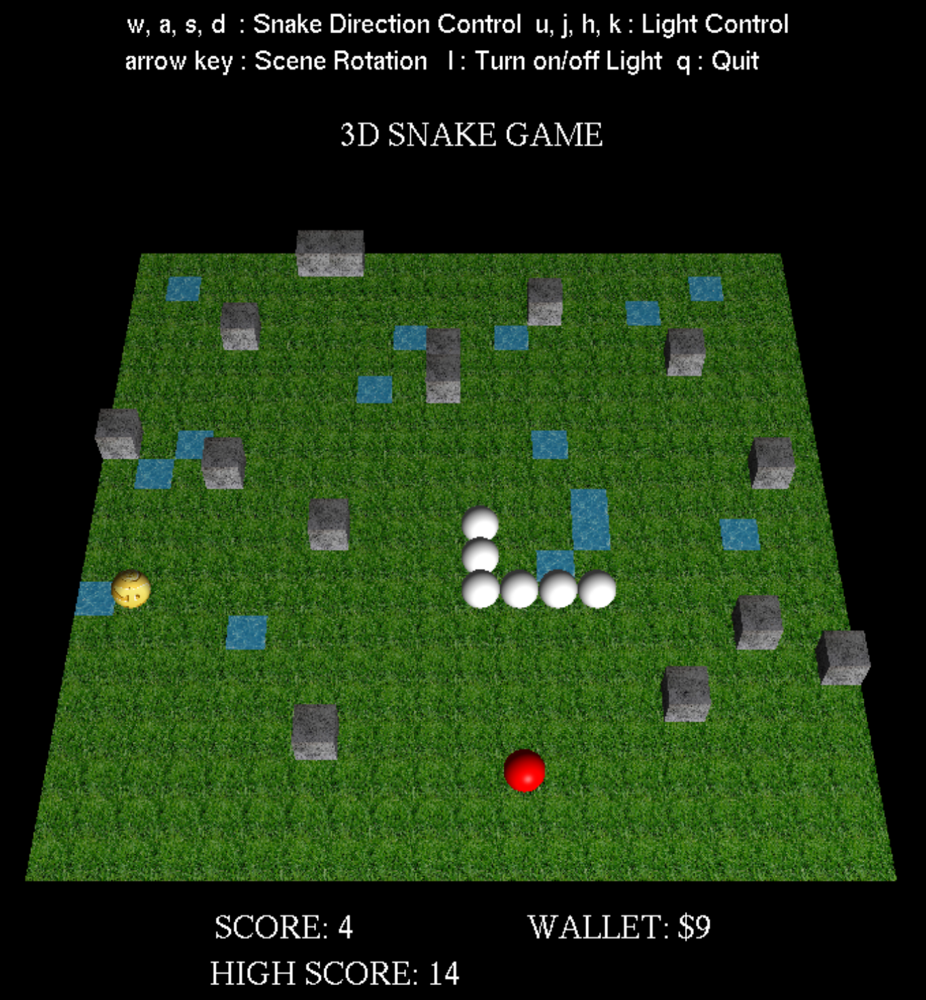

# 3D Snake Game - 3GC3 Final Project

<p align="center" >
Zhenqi Chai 400223880  &nbsp; &nbsp;  Nico Stepan 001404582</br>
</p>
<p align="center">
Shengyu Wu 400075340   &nbsp; &nbsp;  Zihao Chen 001405956
 </p>

<p align="center">

</p>

## Graphics Features

This snake game includes the following graphics features as explored in class:
### 1. Lighting

We have implemented different lighting options. These include changing the position of the light, by pressing **u, j, h, k**, or by toggling the main scene light.

### 2. Textures

In this game, there are multiple textures being rendered. For example, the entire map that the snake moves on has a grass texture binded to it. Other textures include a stone texture for obstacles, money texture for coins, and water texture for ponds. All of these objects appear on the map, and can be interacted with.

### 3. Alpha Blending

The alpha blending feature is implemented in the game and can be observed when the snake interacts with a pond object. When the snake interacts with the pond, it becomes slightly transparent for one move iteration in whatever direction it's currently travelling in. 

### 4. Picking

Ray casting is implemented in this game such that the user can use currency to select and delete stone obstacles througout the map. Deleting an object requires 5 currency and can be achieved by **left-clicking** on an obstacle.

### 5. Non-Geometric Primitives

There is a user interface rendered around the main game screen area. Using ```gluBitMapCharacter```, we render a title with instructions, along with a section for currency and scores which are constantly changing as the game progresses. They are rendered in such a way that when the game map is rotated, using the **arrow keys**, their appearance is unaffected.

## Instructions

The following code snippet displays the possible commands for this program:

```
##########################################
###########      COMMANDS      ###########
##########################################
#   Press the space bar to begin!        #
##########################################
#   'w' --> move the snake up            #
#   's' --> move the snake down          #
#   'a' --> move the snake left          #
#   'd' --> move the snake right         #
##########################################
#   'l' --> toggle lighting on or off    #
#   'u' --> change light (+y) position   #
#   'j' --> change light (-y) position   #
#   'k' --> change light (+z) position   #
#   'h' --> change light (-z) position   #
##########################################
#    Arrow keys rotate the scene         #
##########################################
#   Left-click on an obstacle to         #
#   eliminate it                         #
#       (costs 5 currency)               #
#                                        #
#   Right-click to bring up menu         #
#       (customize  speed and            #
#       number of obstacles)             #
##########################################
#   'q' --> quit the game                #
##########################################
##########################################
```

How to run: clone this repository, and in the correct directory type ```make```
